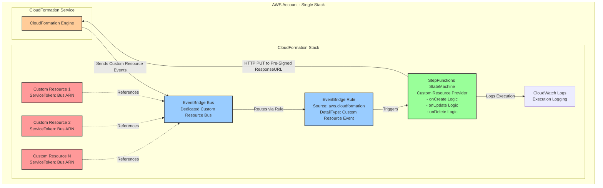
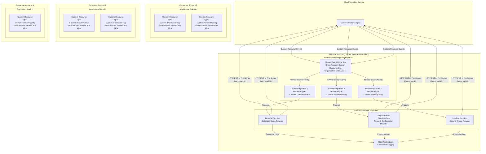

# CloudFormation Custom Resources: EventBridge Integration Proposal

## Executive Summary

This proposal introduces EventBridge Bus ARN as a third ServiceToken type for CloudFormation Custom Resources, complementing the existing SNS and Lambda-backed implementations. This integration addresses current architectural limitations and enables new deployment patterns that improve scalability, maintainability, and cross-account resource sharing.

## Problem Statement

CloudFormation currently supports two Custom Resource ServiceToken types, each with significant limitations:

### SNS-Backed Custom Resources
- **No built-in filtering**: All subscribers receive all messages, requiring custom filtering logic
- **Limited target types**: Cannot directly invoke StepFunctions StateMachines or other EventBridge-supported targets
- **Message delivery constraints**: SNS delivery semantics may not align with custom resource requirements

### Lambda-Backed Custom Resources
- **Direct coupling**: Tight binding between custom resources and their providers
- **Asset management overhead**: Requires bundling, versioning, and deployment of Lambda function code
- **Runtime maintenance burden**: Lambda runtimes age requiring regular code updates
- **Cross-account complexity**: Limited Lambda resource policy support complicates organizational deployments

## Proposed Solution

Introduce **EventBridge Bus ARN** as a third ServiceToken type for CloudFormation Custom Resources.

### Syntax
```yaml
Resources:
  MyCustomResource:
    Type: AWS::CloudFormation::CustomResource
    Properties:
      ServiceToken: !GetAtt MyEventBridge.Arn
      # Custom properties...
```

### Core Benefits
- **Decoupled architecture**: Custom resources and providers operate independently
- **Enhanced target support**: Native integration with Lambda, StepFunctions, SQS, SNS, and all EventBridge targets
- **Built-in filtering**: EventBridge rules enable precise event routing based on resource properties
- **Cross-account sharing**: Full IAM resource policy support for organizational deployments
- **Operational excellence**: Event replay, DLQ support, and comprehensive logging capabilities
- **Asset-free deployment**: Enables custom resource patterns without code bundling requirements

## Architecture Patterns

### Use Case 1: Asset-less Custom Resource Provider



**Components within single stack:**
- StepFunctions StateMachine implementing custom resource lifecycle
- Dedicated EventBridge bus for custom resource events
- EventBridge rule routing events to StateMachine
- Custom resources using the bus as ServiceToken

**Advantages:**
- Zero asset management overhead
- Natural StackSets compatibility
- Simplified CI/CD pipelines
- Reduced deployment complexity

### Use Case 2: Centralized Custom Resource Providers



**Platform account components:**
- Shared EventBridge bus with organization-wide access
- Multiple custom resource providers (Lambda, StepFunctions)
- EventBridge rules routing by ResourceType to appropriate providers

**Consumer account components:**
- Custom resources targeting the shared bus ServiceToken
- No provider implementation required

**Advantages:**
- Centralized provider governance
- Consistent resource behavior across accounts
- Reduced duplication of provider logic
- Platform team ownership model

## Strategic Alignment

This proposal aligns with AWS strategic initiatives:
- **Serverless-first architecture**: Reduces operational overhead through managed services
- **Event-driven patterns**: Promotes modern, decoupled application design
- **Multi-account governance**: Enhances enterprise deployment capabilities
- **Developer productivity**: Simplifies custom resource development and maintenance

## Backwards Compatibility

EventBridge Bus ARN support represents an additive enhancement to CloudFormation. Existing SNS and Lambda-backed custom resources continue operating unchanged, ensuring zero impact on current deployments.

*Prepared for internal AWS product team review*