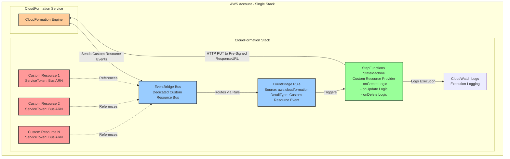

```mermaid
graph TB
    subgraph "AWS Account - Single Stack"
        subgraph "CloudFormation Stack"
            CR1[Custom Resource 1<br/>ServiceToken: Bus ARN]
            CR2[Custom Resource 2<br/>ServiceToken: Bus ARN]
            CR3[Custom Resource N<br/>ServiceToken: Bus ARN]
            
            EB[EventBridge Bus<br/>Dedicated Custom Resource Bus]
            
            RULE[EventBridge Rule<br/>Source: aws.cloudformation<br/>DetailType: Custom Resource Event]
            
            SF[StepFunctions StateMachine<br/>Custom Resource Provider<br/>- onCreate Logic<br/>- onUpdate Logic<br/>- onDelete Logic]
            
            CW[CloudWatch Logs<br/>Execution Logging]
        end
        
        subgraph "CloudFormation Service"
            CFN[CloudFormation Engine]
        end
    end
    
    %% Event Flow
    CFN -->|Sends Custom Resource Events| EB
    EB -->|Routes via Rule| RULE
    RULE -->|Triggers| SF
    SF -->|Logs Execution| CW
    SF -->|HTTP PUT to Pre-Signed ResponseURL| CFN
    
    %% Resource Relationships
    CR1 -.->|References| EB
    CR2 -.->|References| EB
    CR3 -.->|References| EB
    
    %% Styling
    classDef customResource fill:#ff9999,stroke:#333,stroke-width:2px
    classDef eventBridge fill:#99ccff,stroke:#333,stroke-width:2px
    classDef stepFunction fill:#99ff99,stroke:#333,stroke-width:2px
    classDef cloudFormation fill:#ffcc99,stroke:#333,stroke-width:2px
    
    class CR1,CR2,CR3 customResource
    class EB,RULE eventBridge
    class SF stepFunction
    class CFN cloudFormation
```