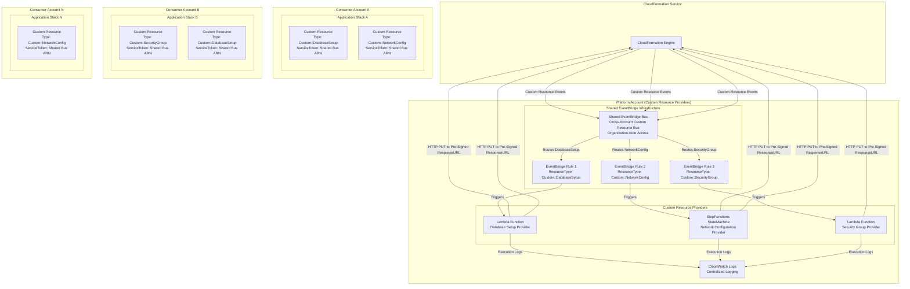

```mermaid
graph TB
    subgraph "CloudFormation Service"
        CFN[CloudFormation Engine]
    end

    subgraph "Platform Account (Custom Resource Providers)"
        subgraph "Shared EventBridge Infrastructure"
            SHARED_BUS[Shared EventBridge Bus<br/>Cross-Account Custom Resource Bus<br/>Organization-wide Access]
            
            RULE1[EventBridge Rule 1<br/>ResourceType: Custom::DatabaseSetup]
            RULE2[EventBridge Rule 2<br/>ResourceType: Custom::NetworkConfig]
            RULE3[EventBridge Rule 3<br/>ResourceType: Custom::SecurityGroup]
        end
        
        subgraph "Custom Resource Providers"
            LAMBDA1[Lambda Function<br/>Database Setup Provider]
            SF1[StepFunctions StateMachine<br/>Network Configuration Provider]
            LAMBDA2[Lambda Function<br/>Security Group Provider]
        end
        
        LOGS[CloudWatch Logs<br/>Centralized Logging]
    end
    
    subgraph "Consumer Account A"
        subgraph "Application Stack A"
            CRA1[Custom Resource<br/>Type: Custom::DatabaseSetup<br/>ServiceToken: Shared Bus ARN]
            CRA2[Custom Resource<br/>Type: Custom::NetworkConfig<br/>ServiceToken: Shared Bus ARN]
        end
        
        CFN[CloudFormation Engine]
    end
    
    subgraph "Consumer Account B"
        subgraph "Application Stack B"
            CRB1[Custom Resource<br/>Type: Custom::SecurityGroup<br/>ServiceToken: Shared Bus ARN]
            CRB2[Custom Resource<br/>Type: Custom::DatabaseSetup<br/>ServiceToken: Shared Bus ARN]
        end
        
        CFN[CloudFormation Engine]
    end
    
    subgraph "Consumer Account N"
        subgraph "Application Stack N"
            CRN1[Custom Resource<br/>Type: Custom::NetworkConfig<br/>ServiceToken: Shared Bus ARN]
        end
        
        CFN[CloudFormation Engine]
    end
    
    %% Cross-Account Event Flow
    CFN -->|Custom Resource Events| SHARED_BUS
    CFN -->|Custom Resource Events| SHARED_BUS
    CFN -->|Custom Resource Events| SHARED_BUS
    
    %% Rule-based Routing
    SHARED_BUS -->|Routes DatabaseSetup| RULE1
    SHARED_BUS -->|Routes NetworkConfig| RULE2
    SHARED_BUS -->|Routes SecurityGroup| RULE3
    
    %% Provider Invocation
    RULE1 -->|Triggers| LAMBDA1
    RULE2 -->|Triggers| SF1
    RULE3 -->|Triggers| LAMBDA2
    
    %% Response Flow
    LAMBDA1 -->|HTTP PUT to Pre-Signed ResponseURL| CFN
    LAMBDA1 -->|HTTP PUT to Pre-Signed ResponseURL| CFN
    SF1 -->|HTTP PUT to Pre-Signed ResponseURL| CFN
    SF1 -->|HTTP PUT to Pre-Signed ResponseURL| CFN
    LAMBDA2 -->|HTTP PUT to Pre-Signed ResponseURL| CFN
    
    %% Logging
    LAMBDA1 -->|Execution Logs| LOGS
    SF1 -->|Execution Logs| LOGS
    LAMBDA2 -->|Execution Logs| LOGS

    
    class CRA1,CRA2,CRB1,CRB2,CRN1 customResource
    class SHARED_BUS,RULE1,RULE2,RULE3 eventBridge
    class LAMBDA1,SF1,LAMBDA2 provider
    class CFNA,CFNB,CFNN cloudFormation
```